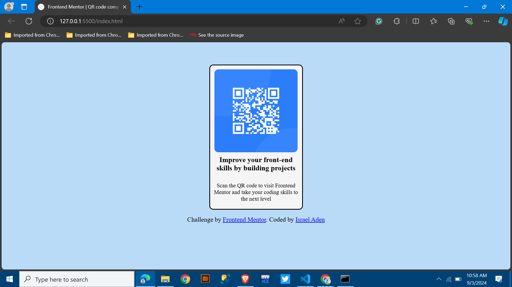

# Frontend Mentor - QR code component solution

This is a solution to the [QR code component challenge on Frontend Mentor](https://www.frontendmentor.io/challenges/qr-code-component-iux_sIO_H). Frontend Mentor challenges help you improve your coding skills by building realistic projects. 

## Table of contents

- [Overview](#overview)
  - [Screenshot](#screenshot)
  - [Links](#links)
- [My process](#my-process)
  - [Built with](#built-with)
  - [What I learned](#what-i-learned)
  - [Continued development](#continued-development)
- [Author](#author)
- [Conclusion](#acknowledgments)

## Overview
    A simplified version of the frontend Mentor qr code challenge
### Screenshot
  

### Links

- Solution URL: (https://is-ra-el.github.io/FM-001/)
- Live Site URL:(https://is-ra-el.github.io/FM-001/)

## My process
  the challenge was completed with basic Html and Css codes 
### Built with

- Semantic HTML5 markup
- CSS custom properties

### What I learned

I still have a long way to go as far as web-dev is concerned

### Continued development

I want to focus more on structuring
my code is bulky because i'm inept at structuring

## Author

- Israel Aden
- Frontend Mentor - (https://www.frontendmentor.io/profile/Is-Ra-El)

## Conclusion
I look forward to doing better and being more efficient on sunsequent projects!

